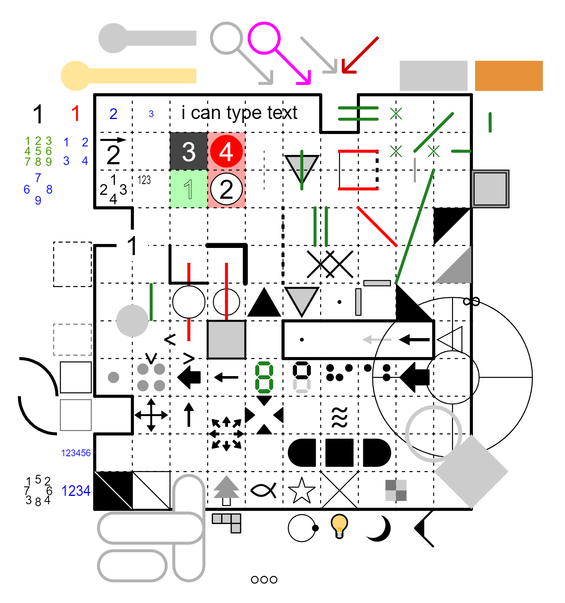
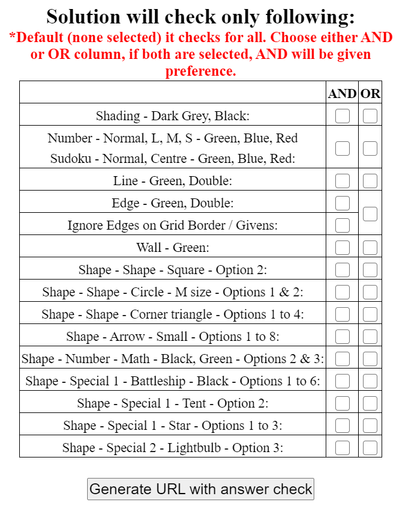

# penpa-editor

Universal pencil puzzle editor capable of drawing many different kinds of pencil puzzles. You can also solve problems in the software.

You can save images and text in the form of URLs that can be loaded in a browser.

If the message "Invalid address" is displayed on a supported browser, try clearing the cache.

Depending on the browser you can update the page without using the cache with "Ctrl" + "R", "Ctrl" + "F5", "Shift" + "F5", etc.

## Sample Preview of the possibilities of this tool

## Compatible browsers
* Google Chrome
* Safari
* Firefox
* Microsoft Edge

## Shortcut keys
* Ctrl + z: Undo
* Ctrl + y: Redo
* Ctrl + d: Clone
* Ctrl + i: To copy the previous number/alphabet/symbol from Number mode with PANEL: ON
* Ctrl + space: Delete numbers and symbols at the same time
* Shift + space: Enter a space (Works in "Number" Mode => "L", "M", "S" and Long" SubMode options only)
* F2: Problem mode
* F3: Solution mode
* F4: Hide/Show Timer
* TAB/ENTER: checkout the TAB section below in "Current functions". Tab settings are now retained in the shared URL.
* In Sudoku Mode
	* Z : Normal Submode
	* X : Corner Submode
	* C : Centre Submode
	* V : Shading (Surface Mode)
	* SHIFT : For Temporary Corner Submode
	* SHIFT + DEL : Deletes only corner pencil marks from the selected cells
	* CTRL - For Temporary Centre Submode / Selecting Multiple Cells/ Deselecting selected cells
	* CTRL + DEL : Deletes only centre pencil marks from the selected cells
	* DEL : To delete all the contents of the cell
	* SPACEBAR : To delete only the selected submode contents. (E.g. If the cell contains both centre and corner pencil marks, and if the current submode selection is "Corner submode", the pressing Spacebar would delete only the corner pencil marks)
	* Drag the mouse pressing left click / drag your finger holding down on Mobile or Ipad for multiple cell selection
	* Border: ON - will allow you to write digits on the edges
* In Surface Mode
	* Use number keys to quickly switch between styles.

## Tips
* Numbers: Back Space can be entered on the panel "1" tab and half-width space can be entered on the "A" tab.
* Number>Arrow: Enter an arrow in the direction you dragged the square.
* Symbol: Input with the numeric keys 1-9,0. When the panel is turned on, a list of symbols that can be entered is displayed, and it corresponds to 1, 2, ... from the upper left. To use the panel place the cursor on the panel symbol and click the board. Erase with two clicks.
* Some symbols such as symbol> figure> cross are onoff input formats. Click the panel to enter directly. Special example: Digital (frame) with the same key. If you press it twice, only the frame will be displayed.
* Special: Delete by clicking the first square of the entered symbol.
* Special: The tip position can be returned to the front by returning to the path that was used during input.
* V: Visibility Button. Users can now choose if they dont want the solution visible in the "Problem" mode. Default is "ON". In "Solution" mode everything will be visible.
* Draw on Edges: Turning on this button will allow users to place the objects (shapes, numbers) on the edges/corners of the grid.
* Constraints (Beta): This feature is to aid puzzle constructors to find certain elements quickly for well known puzzle types. It is currently supported for square grid type. [Note - I will frequently add new types and expand the support to other grid types but if you have a certain genre in mind, you can send a request to penpaplus@gmail.com or contact via other options available through "i" information button on the top right]

## Current functions

### Board types
* Square
	* Rows: Row size, Number of rows in your puzzle
	* Columns: Column size, Number of columns in your puzzle
	* White Space:
		* Over: Number of empty rows from the top. They are removed from the Row Size.
		* Under: Number of empty rows from the bottom. They are removed from the Row Size.
		* Left: Number of empty columns from the left. They are removed from the Column Size.
		* Right: Number of empty columns from the right. They are removed from the Column Size.
	* Example: If you want grid size of 9x9 and 3 empty rows and columns on either side. Then you need to set Rows - 15, Columns - 15, Over - 3, Under - 3, Left - 3, Right -3
* Hexagon
	* Side
	* White Space: Side
* Triangle
	* Side
	* White Space: Border
* Pyramid
	* Side
	* White Space: Border
* Cube
	* Side
* Sudoku
	* Diagonal \
	* Diagonal /
	* Skyscraper/Little Killer
	* Sandwich
	* Sizes 4x4, 6x6, 8x8, 9x9 (default)
* Kakuro
	* Rows
	* Columns
* Tetrakis Square
	* Side
* Truncated Square
	* Side
* Snub Square
	* Side
* Cairo Pentagonal
	* Side

### Surface
* Fill cells. Select a color by style. (Nurikabe, Iceburn, Shakashaka etc.)
* In Dark grey mode only, click twice to get a green square.
* Light grey is used when hiding grey letters and symbols.
* Irrespective of any Style selected, Right click to enter the green square. This feature is to provide a quick access to secondary color (fixed to green currently)

### Line
* Normal: A line connecting the center of the square to the horizontal and vertical. (Masyu, Hashi, Palindrome Sudoku, etc.)
* Diagonal: A line connecting the centers of two diagonally adjacent squares. (Zigzag etc.)
* Free: A line that connects arbitrary squares. (Night tour etc.)
* Middle: A line connecting the center of the square and the center of the side.
* Helper (x): An auxiliary cross mark placed on the side.
* Select the color and thickness of the line by style.

### Edge
* Normal: A line that connects two horizontal or vertical vertices of a square. (Heyawake, Slitherlink etc.)
* Diagonal line: A line connecting two diagonal vertices of a square. (Diagonal Sudoku etc.)
* Free line: A line that connects the vertices of any square. (Sharp and blunt loop etc.)
* Helper (x): An auxiliary cross mark placed on the side.
* Erase: Delete the border of the board.
* Select the color and thickness of the line by style.

### Wall
* A vertical or horizontal line drawn inside the square. (Slalom etc.)
* Select the color and thickness of the line by style.

### Number		  
* Normal: Enter numbers, alphabets, and some symbol characters from the keyboard. Some other special symbols are allowed through Panel: ON mode. It also allows custom symbols in the "text" tab (checkout next section for more details)
* L, M, S: Large, medium or small size numbers.
* Candidates: Candidate numbers for Latin Square such as Sudoku. Compatible with 1-9. onoff input.
* Corners: Small characters at the four corners. (Kakuro, Hairyrin etc.)
* Sides: Small characters at the middle of the four sides. (Compass etc.)
* Tapa: Characters for Tapa. Up to 4 characters.
* Arrow: Characters with arrows. Click and hold the mouse and move in the direction of the arrow to draw the arrow. (Yajilin, Castle Wall etc.)
* Long: Long sentence. It is possible to create a list such as seekers.
* Killer: Small characters at the top left corner. (Killer Sudou)
* White, black and red circles have a circle on the back of the numbers.
* White BG: Draw a white circle behind the numbers. Useful when you can't see the numbers because they are hidden behind the lines.
* When the BORDER input is turned on, the character is placed on the side/vertex.

#### Any Unicode Symbol
* Select "Number" mode.
* Then select "Long" or "L" or "M" submode. (Preferrable is Long submode, although it should also work in some other Number submodes (i.e. corner, side, arrow, S)).
* Panel: ON.
* Select "Text" tab in the Panel.
* One can copy unicode symbol (supports most (not all) of them although rendering might be different based on browser) from the websites https://unicode-table.com/en/ or https://www.alt-codes.net/ and paste in the textbox available. (You can click on the symbol/shape in the website, it will allow copying). Based on experience, unicode from https://charbase.com/block has a better chance of getting rendered on different devices as compared to other unicode websites.
* Then click "Insert".
* One can also type in the sentence of words and "Insert".
* Clear button to clear the text area.

### Shape
* Numerous symbols. You can browse the symbols that can be entered by opening the panel. Figures such as 〇 and □, inequality signs, digital numbers, and other symbols unique to puzzles.
* Depending on the style, you can select whether to place the figure on the front side or the back side of the line.
* When the BORDER input is turned ON, the character is placed on the side/vertex.

### Special
* A special symbol that spans multiple squares. (Arrow Sudoku, Thermo Sudoku, moving arrows, square area)
* Click the first cell you entered to erase it.
* Polygon: The vertices are selected in the order in which they are clicked. Click the last clicked vertex or the first clicked vertex again to end selection.

### Cage
* A line that surrounds multiple squares. (Killer Sudoku etc.)
* Killer submode - Automatic drawing of cages. Click and drag to draw the cage. Click on any cell inside the cage to delete it. Overlapping of cages is not allowed using this automatic mode. You may want to use the Free submode to do that.
* Free submode - Complete control over to the user to draw the cages.
* There are 4 styles: black dotted line, black solid line, grey dotted line, and grey solid line.
* Available in square and regular hexagon.

### Box
* Click to remove or add the square that draws the frame of the board. Useful for irregular board shapes.

### Tab
* This is tab selector button.
* User can now select which modes/sub-modes they wan't to rotate when pressing TAB/Enter key.
	* There is search option available.
	* Search is case-insensitive.
* Then you can either press Tab or Enter (closer to the numpad) to rotate between the selected modes.
* SHIFT + Tab, SHIFT + Enter will rotate between the selected modes in the backward direction.
* To clear all selections - Click twice on Select All (It changes to Clear ALL on first click).
* Enable PenpaLite: Turning on this button will remove all the non-preferred modes from the display thereby simplfiying the display. The preferred modes are determined through tab setting. Select your preferrable modes under "Tab/↵" and then turn "ON" PenpaLite.

### Move
* You can move numbers and symbols by dragging. Originally, you cannot move to a square with a number or sign.
* All can be set to move both numbers and symbols, or either numbers or symbols.

### Composite
* Ability to use multiple input methods simultaneously.
* Paint:
	* Black / dot: Black square drag input and dot
	* White / circle: White circle drag input and black circle
	* Shakashaka: Pull the triangle to input, left click for dot
* Loop:
	* Line or x: Line and auxiliary x (Castle wall) - Right Click for cross and Left Click for Line. Right click and drag for multiple crosses in one go.
	* Line or OX: Line and 〇× in square (Country road)
	* Edge x: Edge and auxiliary cross marks (x) on edges. Right click for x. Right click and drag for multiple crosses in one go.
	* Edge IO: Edge, auxiliary x, and inside/outside painted yellow and green. ("Surface Second Color" preference can be used to change green.) (Slitherlink, Cave) - Right Click for cross and Left Click for Line
	* Yajilin: Left mouse click - Black square, Left mouse click drag - green line, Right click - dot in center, cross (x) on edges
	* Hashi: Draw the line again to make a double line
* Area / Field:
	* Edge/Aux line: An auxiliary line that represents the connection between the edge and the square
* Object:
	* Battleships: Left click will rotate between circle, square, dot and water. Drag in a direction for that directional ship segment. Right click and drag - multiple water. Once you have a single dot, you can left click and drag to multiple cells. Once you have a water, you can left click and drag to multiple cells as well.
	* Star Battle: Left click - star, Right click - X, Right click and drag - Multiple X's, Right click on edges or corners for green dot.
	* Tents: A tent and a point, an auxiliary x on the side, and a line that connects the tent and a tree - Right click for cross and left click for tent and a point, drag for the line.
	* Magnets: +, - and black square
	* Minesweeper: Left click - mine, Right click - X, Right click and drag - Multiple X's, Right click on edges or corners for green dot.
	* Akari: Left mouse click - Light bulb, Left mouse click drag - dotted black line, Right click - dot in center, cross (x) on edges
	* Arrows: Left click drag to draw an arrow in one of the eight directions in a square.
	* DoubleMines: Left click once - 1 mine, Left click twice - 2 mines, Right click - X, Right click and drag - Multiple X's, Right click on edges or corners for green dot.
* Number logic:
	* Numerical flick: Input the numerical flick. 123456789 from top left to bottom right.
	* Alphabet flick: Enter the alphabet by flick. ABCDEFGH- from top left to bottom right. Enter '-' in the lower right corner.

### Sudoku
* This mode is for Sudoku Solving (It can be used for Creating as well but "Number" mode offers more flexibility for creations. Please checkout "Number" section for more details)
* You can select multiple cells at the same time.
	* Drag the mouse on the cells by holding Left Click
	* Drag the finger on mobile/ipad
	* You can also use keyboard Arrow Keys to move around
	* CTRL key to do multiple selection of cells (Useful if you need to select distinct/far apart cells)
* Shortcuts to switch between sub-modes
	* Z : Normal Submode - Normal sized numbers
	* X : Corner Submode - Small digits placed on corners or sides of the cell
	* C : Centre Submode - Small digits placed in the centre of the cell
	* V : Shading (Surface Mode) - For coloring the cells (12 color choices)
	* SHIFT : For Temporary Corner Submode
	* SHIFT + DEL : Deletes only corner pencil marks from the selected cells
	* CTRL - For Temporary Centre Submode / Selecting Multiple Cells/ Deselecting selected cells
	* CTRL + DEL : Deletes only centre pencil marks from the selected cells
	* DEL : To delete all the contents of the cell
	* SPACEBAR : To delete only the selected submode contents. (E.g. If the cell contains both centre and corner pencil marks, and if the current submode selection is "Corner submode", the pressing Spacebar would delete only the corner pencil marks)
* Border: ON
	* IF border is ON then you can write digits on the edges of the cells.
* 6 Color choices for User Solving
	* Answer check only looks for Green/Blue/Red color if enabled
* Normal, Corner and Centre submodes are also available as part of Tab Selector. Please checkout "Tab selector" section for more details.

### Grid
* You can change the border of the board from the "New grid / Update" menu.
* Grid: Border type
* Gridpoints: Whether to place points at vertices
* Outside frame: Whether to draw a line around the board
* White space: Used when placing numbers outside the grid on the board. (Sandwich puzzle etc.)
* "New grid" button resets the board. The "Update display" button does not reset the board (i.e. it will keep all the puzzle elements you have entered so far), but updates only display size and frame type.

### Transform
* You can rotate and flip the board or remove and add columns or rows from the "Rotate / Move / Add / Remove" menu. Square and pyramid rotate 90°. Regular hexagon and regular triangle rotate 30° on the board surface.
* Adjust the margin of the board with the "Move board to center" and "Fit window to board" buttons.
* After creating the grid, if you want to add additional rows and columns without resetting the board then you can these buttons:
	* Note: This feature only works on Square grid type. It also rests Undo/Redo history. Before removing a row/column ensure they are empty and contains no elements.
	* Top +: Adds a row on the top of the grid
	* Top -: Removes a row from the top of the grid
	* Bottom +: Adds a row in the bottom of the grid
	* Bottom -: Removes a row from the bottom of the grid
	* Left +: Adds a column to the left of the grid
	* Left -: Removes a column from the left of the grid
	* Right +: Adds a column to the right of the grid
	* Right -: Removes a column from the right of the grid

### Save image (Screenshot button)
* Settings:
1. White Border: Setting "No" will remove the extra white space around the grid.
2. Image quality: The higher the quality, the better the image quality, but the larger the image size.
3. File Type: Supported image types: PNG, JPG
* Options:
1. Open in new window: Opens the image in a new TAB
2. Download: .png or .jpg image will be downloaded
3. Cancel: Close the window

### Share
* Title - Describe the Puzzle Type (e.g. Classic Sudoku, Arrow Sudoku)

* Author - Puzzle creator's name

* Rules - Enter rules here

* Genre/Tags - Select specific tags that suit your puzzle. These tags will be used for special answer checking features. (special answer checking features are still under construction)

* Source - If you are not the author of the puzzle, specify the source URL

* Save Undo/Redo (History) - If you checkmark this option, then your action history will be saved in the URL. This is effective only while using "URL for editing" button. Other options will automatically ignore history. Note: Saving history might make URL too big depending on your usage.

* URL for editing
1. Complete creating puzzle in Edit mode "Problem".
2. If you need to save your puzzle creation progress and come back later to edit then click on this button
3. Then you can copy the URL generated or use URL_short button to shorten the generated URL. Look at the Options section below for more detailed description.

* URL for solving
1. Complete creating puzzle in Edit mode "Problem".
2. If you want to share your puzzle for others to solve then click on this button
3. Then you can copy the URL generated or use URL_short button to shorten the generated URL. Look at the Options section below for more detailed description.

* URL for solving with Solution
1. Complete creating puzzle in Edit mode "Problem".
2. Select Edit mode "Solution" and complete the solution. The solution must be entered using certain shape or color which Penpa+ will detect. Check the following image for guidance:

3. If you want to share your puzzle for others to solve with the ability to verify the solution then click on "URL with answer check / Extra options" button. A new window will appear.
	1. Please note that the solution will check only for a certain elements with a certain color and style.
	2. The new window that appeared will show you all the possibilities. Select the relevant options. There are two choices:
		1. "AND" column - Solution will check for all the selected elements.
		2. "OR" column - Solution will check if at least any one of the selected elements is completed.
		3. If both "AND", "OR" column has some checkmarks then Penpa+ will ignore the "OR" column and only consider "AND" column.
		4. If no option is selected, then it will check for all the elements.
	3. You should enter the solution in Step 2 using one of the accepted color and style as shown in the window.
4. Click on "Generate URL with answer check".
5. Then you can copy the URL generated or use URL_short button to shorten the generated URL. Clicking on the "URL_short" button automatically copies the URL, look at the Options section below for more detailed description.
6. You can verify if the solution check is enabled if "Solution Button" is green colored in Solver mode and a text "Automatic answer checking is enabled" is displayed.

* URL for contests
1. This is almost like URL for solving with following exceptions:
	1. No Undo/Redo feature.
	2. No I/O Sudoku Option.
	3. No Share Option.
	4. Some additional display information to help the solver.
2. Useful for online contests (e.g. Logic Masters India - Puzzle Ramayan and Sudoku Mahabharat contests)

* Options
1. Copy: copies the URL to the clipboard
2. Download: downloads a .txt file with the url
3. Open: opens a new TAB with the same url
4. URL_short:
	1. First create an URL using one of the four methods described above.
	2. Click on "URL_short" (It will open a new TAB, URL is automatically copied to your clipboard).
	3. Paste the URL (CTRL + V on windows).
	4. Click "Shorten"
4. Cancel: close the window

* URL with answer check / Extra options (puzzle_output_file -> GMPuzzle output:)
1. This allows user to generate a text file output that follows the submission formatting rules for GMPuzzles (https://tinyurl.com/GMPuzzlesFormatting).
2. It currently supports (this list is frequently updated):
	* Sudoku
		* classicsudoku (cs)
		* thermosudoku (ts)
			* Special -> Thermo
		* arrowsudoku (as)
			* Special -> Sudoku Arrow
		* evenoddsudoku (eos)
			* [Panel: ON] Use Shape mode -> Shape/Circle submode (1st option in the dropdown) and Shape/Square submode (2nd option in the dropdown)
		* consecutivepairssudoku (cps)
			* [Panel: ON] Use Shape mode -> Shape/Circle submode -> XS size (1st option in the dropdown). Set BORDER: ON to put circles on edges.
		* tightfitsudoku (tfs)
			* (Panel: ON) For Slash/Split: Use Shape Mode -> Shape Submode -> "〇△◻x" from dropdown list -> 6th Shape in the Panel
			* For numbers: Use "Corner" submode (6th option) to enter in top left or bottom right corner of the split cell, Normal submode for numbers in the cells without split
	* Number Placement
		* tomtom (tt)
			* Use +, -, x, / from keyboard for mathematical operator
			* For numbers: Number mode -> "Corner" submode (6th option)
		* skyscrapers (ss)
			* Ensure 1 white row/column on top/botton and left/right - e.g. If your puzzle is 7x7 size, then set the Rows = 9, Columns = 9, White Space: Over = 1, Under = 1, Left = 1, Right = 1 in the New Grid settings
		* kakuro
			* (Panel: ON) For Slash/Split: Use Shape Mode -> Special 1 Submode -> "kakuro" from dropdown list -> 1st and 2nd Shape in the Panel
			* For numbers: Use "Corner" submode (6th option) and "W" style (white) to enter in top right or bottom left corner of the split cell, Normal submode for numbers in the cells without split (Green or Blue color)
		* doublekakuro (dk)
			* (Panel: ON) For Slash/Split: Use Shape Mode -> Special 1 Submode -> "kakuro" from dropdown list -> 1st and 2nd Shape in the Panel
			* For numbers: Use "Corner" submode (6th option) and "W" style (white) to enter in top right or bottom left corner of the split cell, Normal submode for numbers in the cells without split (Green or Blue color)
			* For 2x2 regions: Use Surface mode and shade the upper-left corner of a 2x2 region with grey color and remaining 3 cells with green color.
			* Solution: Use Number mode --> Normal submode. Fill in all the white and grey shaded cells with appropriate numbers and ignore the green shaded cells. This is similar to as it's described in the document. They grey shaded cell contains the number that belongs to corresponding 2x2 region.
	* Object Placement
		* Statue Park (sp)
			* [Panel: ON] Use Shape mode -> Shape/Circle submode
		* minesweeper (ms)
			* Use 1 to represent mine in the Solution
		* doubleminesweeper (dms)
			* Use 1 and 2 to represent mines in the Solution
		* starbattle (sb)
			* specify number of stars after puzzle type [e.g starbattle2 or starbattle3]
			* use grey shading in solution mode for stars, it is assumed rows=columns as per GMPuzzles formatting
		* battleships (bs)
			* ensure 1 white row/column on bottom and right - e.g. If your puzzle is 10x10 size, then set the Rows = 11, Columns = 11, White Space: Over = 0, Under = 1, Left = 0, Right = 1 in the New Grid settings
			* For numbers: use Normal submode
			* (Panel: ON) For Shapes: use Shape Mode -> Specal 1 submode -> Battleship from dropdown list
			* Unfortunately there is no good way to ask the fleet from user, this output will come with standard fleet, you need to manually modify the [# of types of ships] and [fleet description] if your puzzle has a different set
	* Shading Puzzles
		* kurotto
			* Use Number mode -> White circle Style
			* for empty circle - just place white circle with any digit and then press backspace to remove the digit
		* kuromasu (Use Number mode -> White circle Style)
		* tapa (Number mode -> Tapa submode)
		* nurikabe
		* nanro
		* lits
		* crossthestreams (cts)
			* ensure enough white row/column on top and left - e.g. If your puzzle is 10x10 size and has 4 rows of clues above and 3 columns of clues in the left, then set the Rows = 14, Columns = 13, White Space: Over = 4, Under = 0, Left = 3, Right = 0 in the New Grid settings
			* enter clues using Number mode -> Normal submode (use the multiplication character on digit 8 from the keyboard for star)
			* use grey shading in solution (Surface mode)
	* Region Division Puzzles
		* fillomino
		* pentominous
		* cave
		* snakepit
			* Use Number mode -> White circle Style
			* for empty circle - just place white circle with any digit and then press backspace to remove the digit
		* araf (Use Number mode -> White circle Style, green edge in solution mode for regions)
		* spiralgalaxies (sg)
			* (Panel: ON) use 2nd or 8th or 9th position circles for Black, White and Grey circle respectively in the Shape -> Shape -> Circle
			* (Border: ON) for placing circles on edges and corners
			* green edge in solution mode for regions
	* Loop/ Path Puzzles
		* balanceloop
			* Use Number mode -> White circle style / Black circle style
			* for empty circle, just place white / Black circle with any digit and then press backspace to remove the digit
		* masyu (Use Shape mode -> Shape/Circle submode [Panel: ON])
		* tapalikeloop
		* slitherlink
		* yajilin
			* (Panel: ON) For square - Shape mode -> Shape submode -> Square (from dropdown list - XL size will occupy entire cell), use grey square (9th shape in the panel)
			* For Number and Arrow: use Number mode -> Arrow submode (drag the mouse in the cell for the arrow, type in the number from keyboard or select from panel)
		* doubleyajilin
			* (Panel: ON) For square - Shape mode -> Shape submode -> Square (from dropdown list - XL size will occupy entire cell), use grey square (9th shape in the panel)
			* For Number and Arrow: use Number mode -> Arrow submode (drag the mouse in the cell for the arrow, type in the number from keyboard or select from panel)
		* castlewall
			* (Panel: ON) For square - Shape mode -> Shape submode -> Square (from dropdown list - XL size will occupy entire cell), use black and white square respectively (2nd and 8th shape in the panel)
			* For Number and Arrow: use Number mode -> Arrow submode (drag the mouse in the cell for the arrow, type in the number from keyboard or select from panel)
			* Use white color style for arrow and clue on black square
3. How to use it?
	1. Create a Puzzle in "Edit: Problem" mode using the guide provided in Step 2.
	2. Select "Solution Mode" and fill in the solution (Grey shading, Green numbering, Green loop, Green edge).
	3. click on Share -> URL with answer check / Extra options -> puzzle_output_file.
	4. In the "Header" area, type the puzzle type you are creating.
	5. click on "GMPuzzle output" button.
	6. Specify your required filename and click "Download" button.
		* Template: [Constructor Initials]-[SubmissionID]-[Genre]-[ShortTitle].txt
		* Example: SG-012-kurottu-pairs.txt

### Clone
* Opens the puzzle in new link in new tab. Its like making a copy/duplicate of the Puzzle.

### I/O Sudoku
* This function is to allow the flexibility of Importing and Exporting a Sudoku. It supports Import and Export to https://www.sudokuwiki.org/sudoku.htm solver.
	* Import Sudoku
		* Type the input string in the text area which contains digits (0-9) where 0 or (.) is used for an empty cell. No spaces in the string. The number of digits entered should be a perfect square. Basically (1,4,9,16,25,36,49,64,81) is allowed. That is grid size of 1x1 to 9x9.
		* If its default sudoku grid created from the New Grid options then Penpa automatically knows the position of the Sudoku grid.
		* User can also select a square portion of the grid and import the digits. User needs to specify the location of the first cell in terms of Row and Column. Then specify the Sudoku gridsize (Size:). Default is 9x9.
	* Export Sudoku
		* If its default sudoku grid created from the New Grid options then Penpa automatically knows the position of the Sudoku grid.
		* User can also select a square portion of the grid and export the digits. User needs to specify the location of the first cell in terms of Row and Column. Then specify the Sudoku gridsize (Size:). Default is 9x9.
		* Ignore Pencil Marks - Sometimes we want to export the Sudoku grid in the middle of the solve. Checkmark this option and then export to ignore the Corner and Centre digits used while solving.
		* Pressing Export button also automatically copies the output string to the clipboard.

### Load
* This function has multiple purposes. Mainly, it is a solution for "URL too long Error".
* If the puzzle is too big and contains a lot of elements, it generates a big URL and the size is limited by the internet. In order to address this issue, one can use this Load button option to copy the big URL and click "Load URL" button.
* Basically, one can share the "Long URL" and ask the user to copy paste in the "Load" button and load the puzzle locally into Penpa.
* Secondly, it can also be used to import https://puzz.link/db/ puzzles. It currently supports:
	* Akari
	* Aqre
	* Araf
	* Ayeheya (Ekawayeh)
	* Balance Loop
	* Castle Wall
	* Cave
	* Cojun
	* Compass
	* Country Road
	* Detour
	* Easy as ABC
	* Factors
	* Fillomino
	* Firefly (Hotaru Beam)
	* Geradeweg
	* Haisu
	* Hashiwokakero (Hashi/Bridges)
	* Heyawake
	* Juosan
	* Kakuro
	* Kropki
	* Kurochute
	* Kurodoko
	* Kurotto
	* LITS
	* Masyu
	* Maxi Loop
	* Meandering Numbers
	* Midloop
	* Mochikoro
	* Mochinyoro
	* Moon or Sun
	* Nagenawa
	* Nanro
	* Nonogram
	* Norinori
	* Numberlink
	* Nuribou
	* Nurikabe
	* Nurimaze
	* Nurimisaki
	* Onsen
	* Pencils
	* Regional Yajilin
	* Renban (Renban-Madoguchi)
	* Ring-ring
	* Ripple Effect
	* Shakashaka
	* Shimaguni (Islands)
	* Simple Loop
	* Skyscrapers
	* Slant (Gokigen)
	* Slitherlink
	* Snake
	* Star Battle
	* Stostone
	* Sudoku
	* Symmetry Area
	* Tapa
	* Tapa-Like Loop
	* Tents
	* Tentaisho (Spiral Galaxies)
	* Toichika 2
	* View
	* Yajikazu (Yajisan-Kazusan)
	* Yajilin

### Settings
* This function is to provide Penpa-site general settings like theme, custom color etc.
	* Display Theme: It currently offers only two options (light and dark).
	* Responsive Mode: It currently offers two options (buttons to left side and buttons to right side).
	* Custom Colors: To enable custom colors in certain modes.
	* Sudoku PencilMarks: User preference for "Center" pencil mark size in "Sudoku" mode.
		* Dynamic - Upto 5 digits its larger size and then it becomes small.
		* Large - All digits are large.
		* Small - All digits are small.
	* Sudoku Normal: User preference for "Normal" digits in "Sudoku" mode.
		* Centered - All digits are centered to the cell.
		* Bottom - All digits are shifted downward and close to the bottom of the cell. (Useful to avoid overlap with Killer clues)
	* Starbattle Dots: User preference for Right Click dots in Star battle composite mode.
		* High Range - Default.
		* Low Range - User needs to click much closer to corners and edges for dots.
		* Disable - Completely disable the dot feature and only have Star/Cross.
	* Mouse Middle Button: Shortcut to switch between Problem/Solution mode while in "setter mode". To activate, select YES.
	* Surface Second Color: In Surface Mode, by default right click uses green color for any selected choice of primary color. Using this setting user can choose their own choice of right click (secondary) color. This also affects Composite Edge IO.
	* Reload Protection: Reload Button. Users can now choose if they want the webpage to ask for confirmation for reloading or closing the page. This is to avoid accidental closing of tab or refreshing. Default is "OFF".
	* Panel: Turning on this button will visually display the options to the user while using Number or Shape modes.
	* Shorten Links Automatically: Turning on this button will shorten the Share URL automatically.
	* Timer: User can prefer to hide the entire timer area by selecting "hide" option.
	* Conflict Detection: It is upcoming feature. Some of the puzzle genres have smart checking ability. Default is ON. User can turn it OFF for the ongoing puzzle or for all the future puzzles.
	* Save Settings: Selecting yes, will save the following items in the browser cookies:
		* Theme
		* Responsive Mode
		* Tab settings
		* Reload button status
		* Gridtype
		* Displaysize
		* Sudoku PencilMarks setting
		* Sudoku Normal setting
		* Mouse Middle Button choice
		* Local Storage
		* Conflict Detection
		* Shorten Links Automatically
		When the user returns to fresh Penpa page, these settings are recovered.
	* Local Storage: Default is ON. It stores the local progress of the solution in the solver mode. User can clear the storage of ongoing puzzle using "Clear this puzzle" button or entire storage using "clear all" button.

### Stop Watch
* start - starts the timer. Lowest precision is 1/10th of a second.
* pause - pauses the timer. click on start again to continue.
* stop - stops the timer. click on start again to restart the timer. click on reset to set the timer back to 00:00.
* reset - resets the timer to 00:00.
* hide/show - hide/show the timer.

## LICENSE
Released under MIT license. Check https://github.com/swaroopg92/penpa-edit/blob/master/LICENSE.
